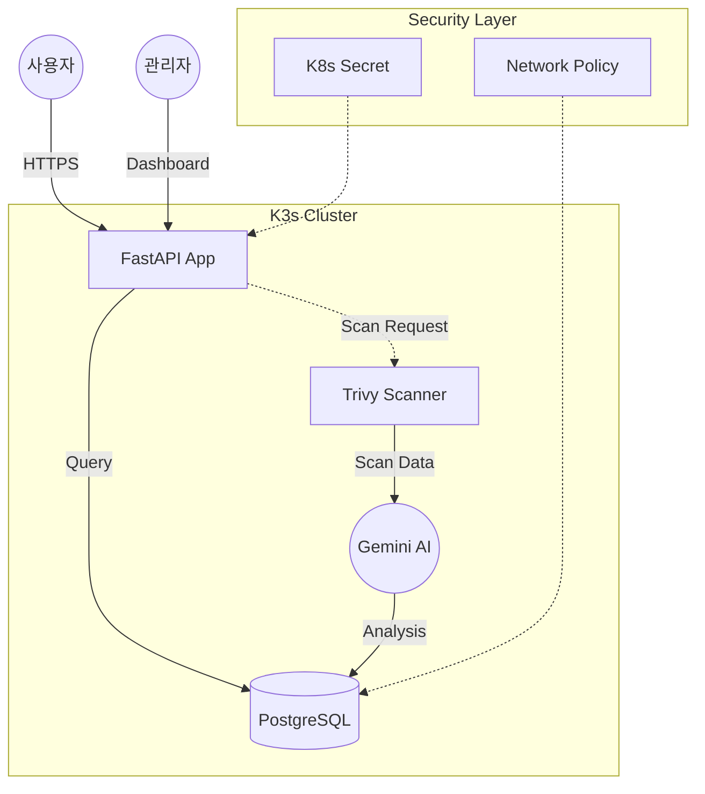

# team-02
Team 02 - MSP Architect Training 2026

## AI 보안 엔진 기반의 Zero-Trust 통합 서비스 플랫폼 구축
사용자 게시판 서비스에 Gemini AI 기반의 자동 보안 진단 및 K3s 네트워크 격리 기술을 결합하여, 서비스 운영과 보안 관리를 일원화한 DevSecOps 플랫폼.

### 프로젝트 개요:

- 서비스 통합: 사용자용 게시판 서비스와 관리자 전용 보안 관제 시스템의 단일 엔드포인트 통합 운영.

- 지능형 진단: Trivy 스캔 데이터를 활용한 Gemini AI의 정밀 분석 및 맞춤형 보안 패치 자동 생성.

- 인프라 격리: K3s 네임스페이스 분리 및 L4 Network Policy를 통한 데이터베이스 마이크로 세그먼테이션 적용.

- 보안 게이트: 이미지 빌드 단계의 고위험 취약점 배포 사전 차단 및 런타임 무결성 확보.

- 실시간 시각화: 파이프라인 분석 결과의 DB 연동을 통한 보안 점수 및 조치 가이드의 GUI 대시보드 구현.

