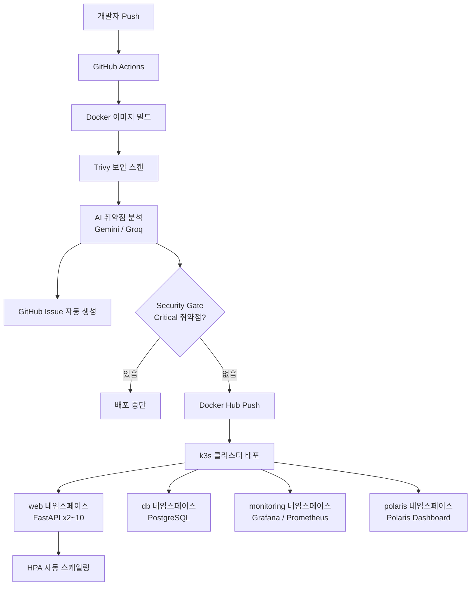

# FastAPI 게시판 기반 DevSecOps 실습 프로젝트

FastAPI 게시판 애플리케이션을 k3s 쿠버네티스 클러스터에 배포하고, GitHub Actions 기반 13단계 파이프라인으로 빌드, 보안 스캔, AI 분석, 자동 배포를 통합한 DevSecOps 시스템입니다.

## 프로젝트 개요 및 목적

본 프로젝트는 FastAPI 기반 게시판 애플리케이션을 직접 개발하고, k3s 쿠버네티스 클러스터에 배포하는 전체 과정을 DevSecOps 방식으로 구성한 실습 프로젝트입니다.

단순한 배포 자동화에 그치지 않고, 보안 스캔(Trivy), AI 기반 취약점 분석(Gemini/Groq), 성능 테스트(Locust)까지 포함하여 개발-보안-운영이 통합된 파이프라인을 직접 구축하고 검증하는 것을 목적으로 합니다.

개발 기간: 2026.02.26 ~ 2026.03.12

## 주요 기능

- GitHub Actions 기반 13단계 CI/CD 파이프라인 자동화
- Trivy를 활용한 컨테이너 이미지 보안 스캔 및 Security Gate 적용
- Gemini/Groq 하이브리드 AI 취약점 분석 및 GitHub Issue 자동 생성
- FastAPI 게시판 애플리케이션 (회원가입, 로그인, 게시글 CRUD, 댓글 기능)
- k3s 클러스터 기반 컨테이너 오케스트레이션
- HPA(Horizontal Pod Autoscaler)를 통한 자동 스케일링
- NetworkPolicy, RBAC 기반 클러스터 보안 구성
- Polaris를 활용한 쿠버네티스 구성 감사
- Grafana/Prometheus 기반 실시간 모니터링
- Locust를 활용한 부하 테스트 및 성능 개선 검증

## 시스템 아키텍처

## Wiki

| 탭 | 설명 |
|------|------|
| [Home](https://github.com/msp-architect-2026/kang-inho/wiki/Home) | 프로젝트 개요 및 마일스톤 |
| [API](https://github.com/msp-architect-2026/kang-inho/wiki/API) | API 엔드포인트 목록 |
| [Application Architecture](https://github.com/msp-architect-2026/kang-inho/wiki/Application-Architecture) | 기술 스택 선택 근거 및 앱 구조 |
| [ERD](https://github.com/kang-4257/kang-inho-practice/wiki/ERD) | DB 테이블 구조 및 관계 |
| [Infra Architecture](https://github.com/msp-architect-2026/kang-inho/wiki/Infra-Architecture) | 인프라 구성 및 네임스페이스 |
| [Monitoring](https://github.com/msp-architect-2026/kang-inho/wiki/Monitoring) | Grafana/Prometheus 모니터링 |
| [DevSecOps Pipeline](https://github.com/msp-architect-2026/kang-inho/wiki/DevSecOps-Pipeline) | CI/CD 파이프라인 13단계 |
| [Security](https://github.com/msp-architect-2026/kang-inho/wiki/Security) | 보안 구성 |
| [Performance Test](https://github.com/msp-architect-2026/kang-inho/wiki/Performance-Test) | 부하 테스트 결과 및 회고 |
| [Vulnerability Fix History]((https://github.com/msp-architect-2026/kang-inho/wiki/Vulnerability-Fix-History)) | AI 보고서 기반 취약점 수정 이력 |
